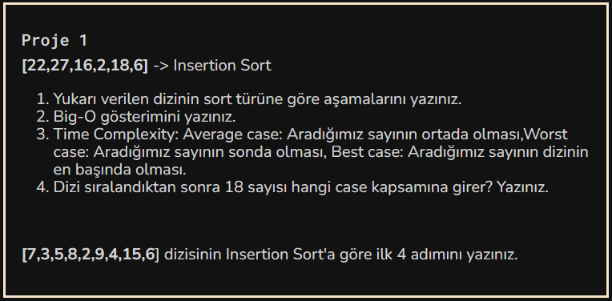

## Veri Yapıları ve Algoritmalar Modülü Projeler
### [Insertion Sort Projesi](/project1.md)
### [Merge Sort Projesi](/project2.md) 
### [Binary Search Tree Projesi](/project3.md)
---
# InsertionShortProject


---
1. Sort türüne göre aşamaları:
    1. ``[2,27,16,22,18,6]``
    2. ``[2,6,16,22,18,27]``
    3. ``[2,6,16,18,22,27]``
---
2. Big-O Gösterimi :
   O ( n<sup>2</sub></sup> )

---

3. Time Complexity:
    1. Avarage case: Aradığımız sayının ortada olması
    2. Worst Case: Aradığımız sayının sonda olması
    3. Best Case: Aradığımız sayının başta olması
---    
4. > Dizi sıralandıktan sonra : ``[2,6,16,18,22,27]`` 18 Sayısı için Avarage case kapsamına girdiği görülür.
---
```` [7,3,5,8,2,9,4,15,6] dizisinin Insertion Sort'a göre ilk 4 adımını yazınız.````<br>
````Sıralanmış dizi elamanları parantez ile belirtilmiştir.  ````


| Dizinin Aşaması|  Açıklaması| Aşama Sonucu|
| :--- | :---: | ---: |
| 1. Aşama| İlk sayıdan bahsettiğimiz için 7 sıralı olur işlem yapılmaz.| ``[(7),3,5,8,2,9,4,15,6]`` |
| 2. Aşama| 3 sıralı olan 7 ile karşılaştırılır duruma göre değişim gerçekleşir. | ``[(3,7),5,8,2,9,4,15,6]`` |
| 3. Aşama| 5 kendinden bir öncekinden başlayarak sıralı grupta kıyaslanarak yerini alır.| ``[(3,5,7),8,2,9,4,15,6]`` |
| 4. Aşama| 8 kendinden bir öncekinden başlayarak sıralı grupta kıyaslanarak yerini alır.|``[(2,3,5,7,8),9,4,15,6] `` |
  

