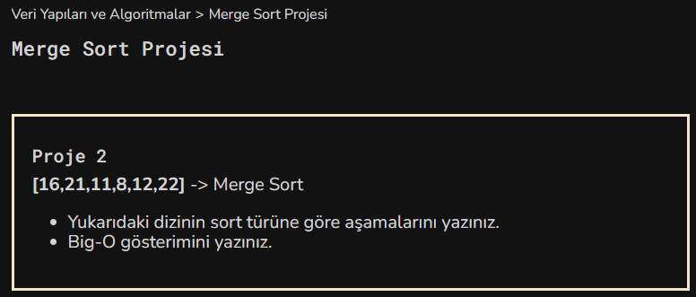

# Veri Yapıları ve Algoritmalar
## Merge Sort Projesi
### Ödev 

* Sıralı olmayan dizi ortadan iki eşit parçaya ayrılır. 
``[16,21,11]``  ve  ``[8,12,22]``
* Bu Ayırma işlemleri alt diziler en fazla 2 olana kadar yapılır. 
``[16,21] [11]``  ve ``[8] [12,22]`` 
* Alt diziler kendi içinde sıralanır. 
``[11,16,21]`` ve ``[8,12,22]``
* Sıralı alt diziyi tek dizi halinde birleştirilir. 
``[8,11,12,16,21,22]``
---
 
Big-O Gösterimi : O ( nlogn )