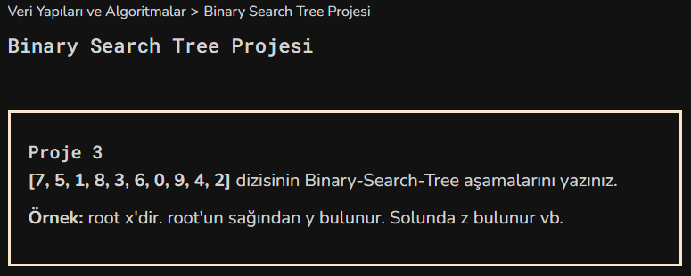

# Veri Yapıları ve Algoritmalar
## Binary-Search-Tree Projesi
### Ödev 

<code>Root değerin Sağından  büyük olanlara solundan küçük olanlara ulaşılabilir.   Her dallanmada  _ - _ sola küçük sağa büyük değerleri yazarak ağaç oluşturabiliriz. </code>

- Aşamalara göz atalım.
   1. Root değeri sorgulanır örneğin 5 
   2. Sağ tarafında kendinden büyük, sol tarafında kendinden küçük elemanlar var.
   3. 0 değerine ulaşmak için solundaki dallanma kontrol edilir.
   4. 9 değeri için sağ tarafındaki dallanma kontrol edilir.

---
 

## Tree Dengeli Olursa

* Avarage Case : O ( logn )
* Worst Case : O ( n )
* Insertion : O ( logn )

---

  

### Proje Ana Sayfasına Dönmek İçin Tıklayınız 
### [Veri Yapıları ve Algoritmalar](/README.md)